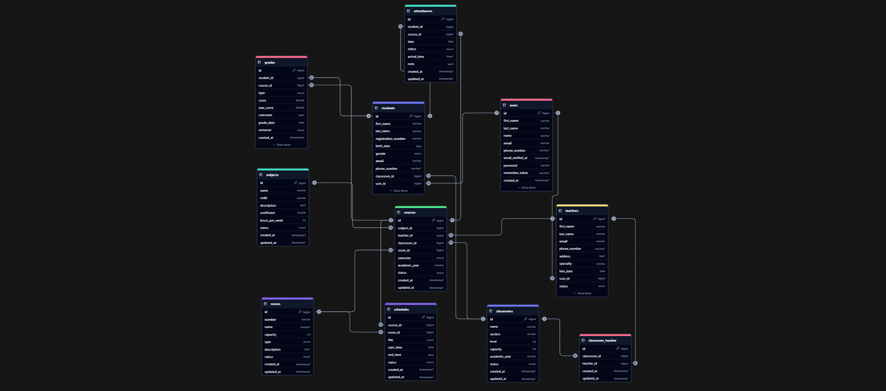

# 🏫 Système de Gestion Scolaire (School Management System)

## 📋 Description
Un système de gestion scolaire complet développé avec Laravel 11, permettant de gérer les étudiants, les professeurs, les classes et plus encore.

## 🛠 Technologies Utilisées
-  PHP 8.3.8
-  Laravel 11
-  MySQL
- 
- 

## 🌟 Fonctionnalités

### 1. Gestion des Utilisateurs
- 👨‍🎓 Étudiants
    - Inscription/Modification/Suppression
    - Profil détaillé avec photo
    - Suivi des notes et présences
    - Génération de carte d'étudiant

- 👨‍🏫 Professeurs
    - Gestion du profil
    - Attribution des classes
    - Gestion des emplois du temps
    - Saisie des notes

- 👨‍💼 Administration
    - Gestion des droits d'accès
    - Tableau de bord administratif
    - Rapports et statistiques

### 2. Gestion Académique
- 📚 Classes
    - Création et gestion des classes
    - Attribution des professeurs
    - Gestion des capacités
    - Suivi des effectifs

- 📝 Notes et Évaluations
    - Système de notation
    - Bulletins semestriels
    - Calcul des moyennes
    - Historique des évaluations

- 📅 Emplois du temps
    - Planning des cours
    - Gestion des salles
    - Conflits d'horaires
    - Calendrier scolaire

### 3. Suivi et Communication
- 📊 Présences
    - Suivi des présences quotidiennes
    - Rapports d'assiduité
    - Alertes d'absences

- 📧 Communication
    - Notifications automatiques
    - Messagerie interne
    - Annonces et actualités
    - Communications parents-professeurs

## 🗄️ Structure de la Base de Données



### Tables Principales
1. `users`
    - Gestion des comptes utilisateurs
    - Authentification et autorisations

2. `students`
    - Informations personnelles
    - Données académiques
    - Relation avec la classe

3. `teachers`
    - Profil professionnel
    - Spécialités
    - Classes assignées

4. `classrooms`
    - Informations sur les classes
    - Capacité et niveau
    - Année scolaire

5. `subjects`
    - Matières enseignées
    - Coefficients
    - Volume horaire

6. `grades`
    - Notes des étudiants
    - Types d'évaluations
    - Calcul des moyennes

7. `attendances`
    - Suivi des présences
    - Justifications
    - Statistiques

## 💻 Configuration Requise

### Prérequis
- PHP  8.3.8
- Composer
- Node.js & NPM
- MySQL  8.0.3
- Extensions PHP requises:
    - BCMath
    - Ctype
    - JSON
    - Mbstring
    - OpenSSL
    - PDO
    - Tokenizer
    - XML

### Installation

1. Cloner le projet
```bash
git clone https://github.com/bayembacke221/school-management.git
```

2. Installer les dépendances
```bash
composer install
npm install
```

3. Configurer l'environnement
```bash
cp .env.example .env
php artisan key:generate
```

4. Configurer la base de données dans .env
```
DB_CONNECTION=mysql
DB_HOST=127.0.0.1
DB_PORT=3306
DB_DATABASE=school_management
DB_USERNAME=root
DB_PASSWORD=
```

5. Migrer la base de données
```bash
php artisan migrate --seed
```

6. Lancer le serveur
```bash
php artisan serve
npm run dev
```

## 📊 API Routes

### Étudiants
```
GET    /api/students       - Liste des étudiants
POST   /api/students      - Créer un étudiant
GET    /api/students/{id} - Détails d'un étudiant
PUT    /api/students/{id} - Modifier un étudiant
DELETE /api/students/{id} - Supprimer un étudiant
```

### Professeurs
```
GET    /api/teachers       - Liste des professeurs
POST   /api/teachers      - Créer un professeur
GET    /api/teachers/{id} - Détails d'un professeur
PUT    /api/teachers/{id} - Modifier un professeur
DELETE /api/teachers/{id} - Supprimer un professeur
```

### Classes
```
GET    /api/classrooms       - Liste des classes
POST   /api/classrooms      - Créer une classe
GET    /api/classrooms/{id} - Détails d'une classe
PUT    /api/classrooms/{id} - Modifier une classe
DELETE /api/classrooms/{id} - Supprimer une classe
```


